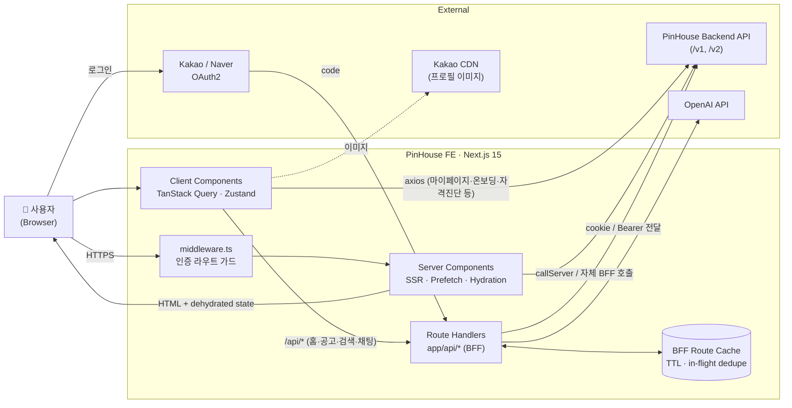
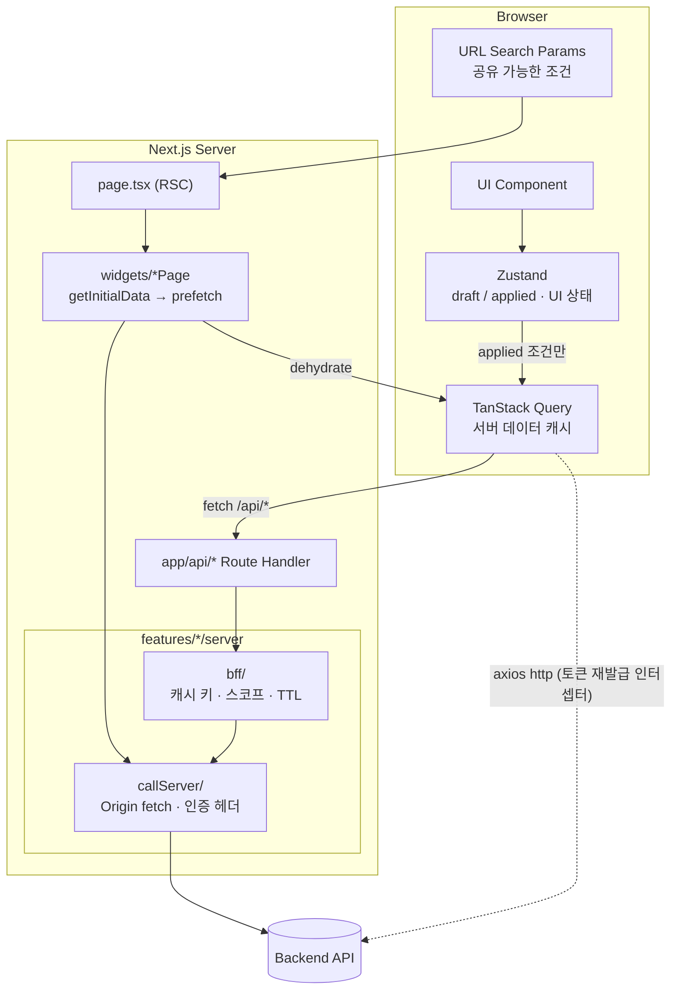
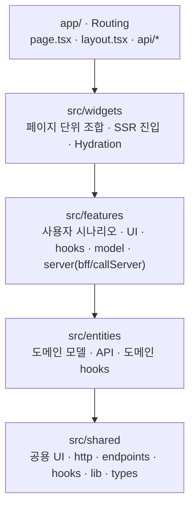
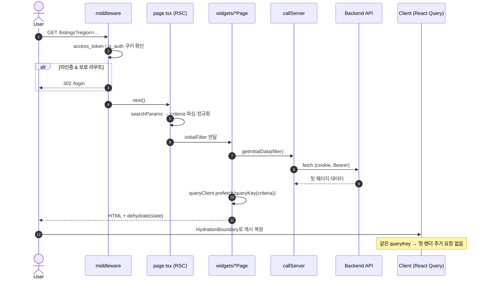
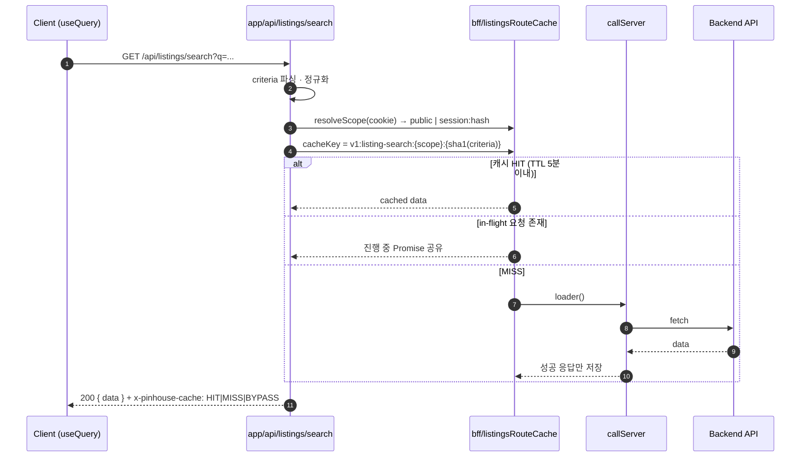
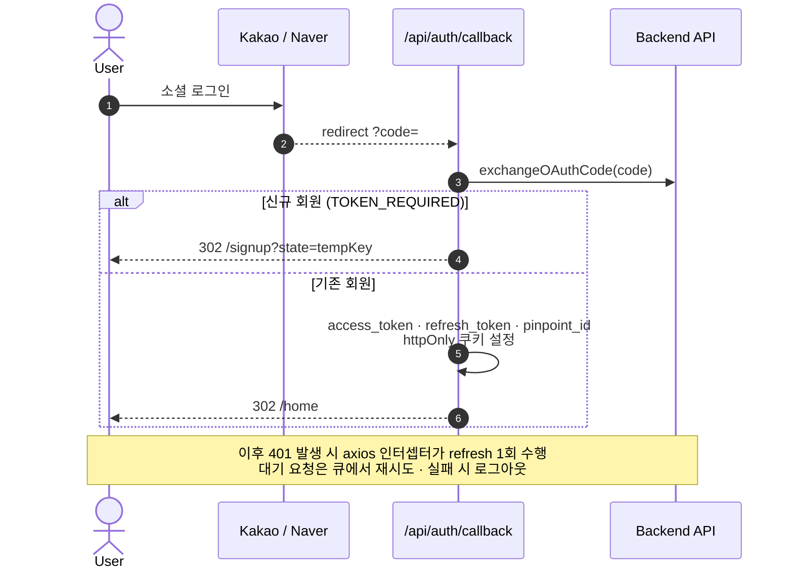
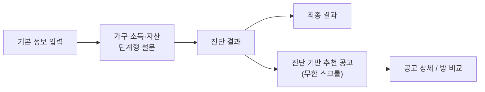
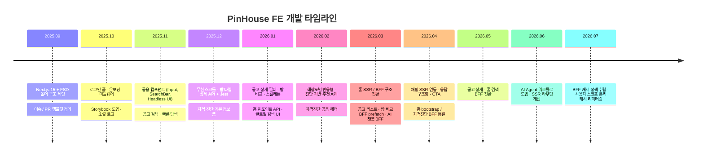
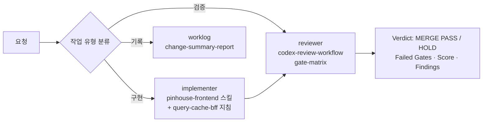

<div align="center">


# PinHouse Frontend

**내 생활 반경(핀포인트)을 기준으로 공공임대 공고를 찾고, 비교하고, 자격까지 진단하는 웹앱**

`개발 기간 2025.09 ~ 2026.07`


</div>

---

## 📑 목차

1. [프로젝트 소개](#-프로젝트-소개)
2. [주요 기능](#-주요-기능)
3. [기술 스택](#-기술-스택)
4. [전체 시스템 구조](#-전체-시스템-구조)
5. [아키텍처 다이어그램](#-아키텍처-다이어그램)
6. [레이어 구조 (FSD Hybrid)](#-레이어-구조-fsd-hybrid)
7. [동작 프로세스](#-동작-프로세스)
8. [프로젝트 구조](#-프로젝트-구조)
9. [핵심 설계 포인트](#-핵심-설계-포인트)
10. [개발 과정](#-개발-과정)
11. [개발 워크플로우 (AI Agent)](#-개발-워크플로우-ai-agent)
12. [시작하기](#-시작하기)

---

## 🏠 프로젝트 소개

공공임대 공고는 LH·SH 등 공급처마다 흩어져 있고, 조건(소득·자산·가구원·거주지)이 복잡해 **"내가 지원할 수 있는 집이 어디인지"** 파악하기 어렵습니다.

**PinHouse**는 사용자가 직장·학교 같은 **핀포인트(생활 거점)** 를 등록하면, 그 위치를 기준으로 공고를 탐색하고 단지·방 타입을 비교하며, 청약 자격 진단 결과에 맞는 공고를 추천합니다.

| 문제 | PinHouse의 해결 |
| --- | --- |
| 공고가 공급처별로 흩어져 있음 | 공고 리스트·글로벌 검색으로 한 곳에서 탐색 |
| 위치 기준 판단이 어려움 | 핀포인트 기준 거리·건수·인프라 제공 |
| 방 타입/단지 비교가 번거로움 | 공고 상세 내 단지·방 비교 기능 |
| 자격 조건이 복잡함 | 단계형 자격 진단 → 추천 공고 연결 |
| 무엇부터 봐야 할지 모름 | 빠른 탐색(퀵서치) + AI 상담 챗봇 |

---

## ✨ 주요 기능

| 기능 | 설명 | 라우트 |
| --- | --- | --- |
| 🔐 **소셜 로그인 / 회원가입** | 카카오·네이버 OAuth2, 서버 콜백에서 토큰을 `httpOnly` 쿠키로 저장 | `/login`, `/signup`, `/api/auth/callback` |
| 🧭 **온보딩** | 서비스 소개 및 초기 핀포인트(주소) 설정 | `/onboarding/[type]` |
| 🏡 **홈** | 핀포인트 기준 공고 건수, 마감 임박 공고, 추천 공고, 검색 태그, 핀포인트 설정 | `/home`, `/home/pinpoints` |
| 🔎 **글로벌 검색** | 카테고리/개요 검색, 인기 검색어, debounce 기반 검색 | `/home/search`, `/listings/search` |
| 📋 **공고 리스트** | 지역·임대유형·공급유형·주택유형 필터, 정렬, 무한 스크롤 | `/listings` |
| 🏢 **공고 상세 / 방 비교** | 단지 정보·인프라·방 타입 상세, 단지/방 비교 바텀시트 | `/listings/[id]`, `/listings/[id]/compare` |
| ✅ **자격 진단** | 단계형 설문 → 진단 결과 → 진단 기반 추천 공고(무한 스크롤), 학교 검색 | `/eligibility/*` |
| ⚡ **빠른 탐색** | 거주 인원·예산·거리·주거환경·방 크기 등 단계별 조건 선택 | `app/_quicksearch` (현재 라우트 비활성) |
| 🤖 **AI 상담 챗봇** | 홈 내 챗 패널, 태그 기반 응답 정책, 지역별 매물 이동 CTA | `/home?chat`, `/api/chat` |
| 👤 **마이페이지** | 프로필 수정, 핀포인트 관리, 설정, 회원 탈퇴 | `/mypage/*` |

---

## 🛠 기술 스택

| 분류 | 기술 |
| --- | --- |
| Framework | Next.js 15 (App Router, Turbopack), React 19 |
| Language | TypeScript 5 |
| Server State | TanStack Query v5 (SSR prefetch + `HydrationBoundary`) |
| Client State | Zustand v5 |
| Styling | Tailwind CSS 3, `class-variance-authority`, `tailwind-merge`, Radix UI, Framer Motion |
| HTTP | Axios (클라이언트, 토큰 재발급 큐), `fetch` (서버 / BFF) |
| AI | OpenAI API (BFF 경유) |
| Test | Jest, ts-jest |
| UI 문서화 | Storybook 9, Chromatic |
| Quality | ESLint 9, Prettier (tailwind plugin) |

---

## 🌐 전체 시스템 구조



---

## 🧱 아키텍처 다이어그램

### 요청 경계: Browser ↔ BFF ↔ Origin



### 상태 책임 분리

| 위치 | 담당 | 넣지 않는 것 |
| --- | --- | --- |
| **URL / Search Params** | 공유·북마크·뒤로가기가 필요한 명시 조건 | 임시 입력값 |
| **Zustand** | 필터 `draft`/`applied`, 시트 open, 선택 중 UI 상태 | 서버 응답 본문 |
| **TanStack Query** | 서버 데이터 조회·캐시·stale·페이지네이션·무효화 | UI 표현 상태 |
| **BFF (`app/api/*`)** | 인증 전달, 조건 검증/정규화, Origin 호출, 서버 캐시 | 클라이언트 조건의 무검증 통과 |
| **axios `http`** | BFF 미전환 도메인의 직접 호출, 401 시 토큰 재발급 | 조회 캐시 정책 |

---

## 🗂 레이어 구조 (FSD Hybrid)

Next.js **App Router(`app/`)** 를 라우팅 전용 레이어로 두고, 실제 구현은 **Feature-Sliced Design(`src/`)** 으로 분리했습니다.



> 의존성은 **위 → 아래 단방향**을 원칙으로 합니다.

| 레이어 | 역할 | 예시 |
| --- | --- | --- |
| `app/` | URL 매핑, `searchParams` 파싱, Route Handler(BFF 엔드포인트) | `app/listings/page.tsx`, `app/api/listings/search/route.ts` |
| `src/app` | 전역 Provider, 설정 | `QueryProvider`, `ThemeProvider` |
| `src/widgets` | 여러 feature를 조합한 화면 블록, 서버 초기 데이터 수집 + prefetch | `ListingsSectionPage`, `HomeSectionPage` |
| `src/features` | 기능 단위 구현 (`ui` / `hooks` / `model` / `api` / `server`) | `listings`, `eligibility`, `chat`, `quickSearch` |
| `src/entities` | 도메인 타입·API·조회 훅 | `listings`, `pinpoint`, `address`, `auth` |
| `src/shared` | 도메인 무관 공용 요소 | `ui/button`, `ui/modal`, `api/http.ts`, `hooks/useDebounce` |

#### feature 내부 구조

```
features/listings/
├── ui/            # 화면 컴포넌트
├── hooks/         # Query / 상호작용 훅
├── model/         # 검색 조건 타입 · 정규화 · 필터 스토어
└── server/
    ├── bff/       # BFF 캐시 키 · 스코프 · TTL · 초기 데이터 조회
    └── callServer/# Origin API 서버 fetch (cookie / Bearer 전달)
```

---

## 🔄 동작 프로세스

### 1) 페이지 진입 — SSR Prefetch & Hydration



### 2) 클라이언트 조회 — BFF 캐시



### 3) 소셜 로그인



### 4) 자격 진단 → 추천



---

## 📁 프로젝트 구조

```
PinHouse_FE
├── app/                         # Next.js App Router (라우팅 · BFF)
│   ├── api/                     # Route Handlers = BFF
│   │   ├── auth/callback/       #   OAuth 코드 교환 · 쿠키 설정
│   │   ├── home/                #   bootstrap · count · notice · pinpoints · recommended · search · searchTag
│   │   ├── listings/            #   search · notice · detail · compare · cache
│   │   └── chat/                #   AI 챗봇
│   ├── home/                    # 홈 · 핀포인트 · 글로벌 검색
│   ├── listings/                # 공고 리스트 · 검색 · 상세 · 비교
│   ├── eligibility/             # 자격 진단 · 결과 · 추천
│   ├── onboarding/  login/  signup/  mypage/
│   └── layout.tsx               # QueryProvider · Toast · BottomNav
├── src/
│   ├── app/providers/           # QueryProvider, ThemeProvider
│   ├── widgets/                 # 화면 조합 + SSR 초기 데이터 / prefetch
│   ├── features/                # addressSearch · chat · eligibility · home · listings
│   │                            # login · mypage · onboarding · quickSearch
│   ├── entities/                # address · auth · chat · home · listings · pinpoint · tag
│   ├── shared/                  # api(http, endpoints) · config(queryKeys) · ui · hooks · lib · types
│   ├── assets/                  # icons(SVGR) · images
│   └── stories/                 # Storybook
├── middleware.ts                # 인증 라우트 가드
├── .agents/                     # AI 에이전트 스킬 · 역할 프롬프트
├── .github/                     # 이슈 / PR 템플릿
└── .storybook/
```

---

## 💡 핵심 설계 포인트

### 1. BFF(Backend For Frontend) 패턴
- 홈·공고 리스트·공고 상세·검색·채팅은 브라우저가 백엔드를 직접 호출하지 않고 `app/api/*` 를 거칩니다.
- 마이페이지·온보딩·자격 진단 등 나머지 도메인은 axios `http` 클라이언트로 백엔드를 직접 호출합니다.
- BFF는 **조건 검증·정규화 → 인증 판별 → 캐시 조회 → Origin 호출** 순서를 지킵니다.
- `bff/`(캐시·스코프) 와 `callServer/`(Origin fetch) 로 책임을 분리해 SSR과 Route Handler가 같은 로더를 재사용합니다.

### 2. 사용자 스코프 분리 캐시 (공고 리스트 · 공고 검색 BFF)
- 캐시 키: `{version}:{domain}:{scope}:{sha1(normalizedCriteria)}`
- `scope` 는 쿠키가 없으면 `public`, 있으면 `session:{hash(accessToken, pinpointId)}` → **사용자 A의 개인화 결과가 B에게 노출되지 않음**.
- TTL 5분, **in-flight Promise 공유**로 동시 중복 Origin 호출 방지, 빈/실패 응답은 캐시하지 않음.
- prefix 단위 무효화 함수(`invalidateListingsRouteCacheByPrefix`) 제공.
- `ListingsCacheAdapter` 인터페이스로 추상화 → 인메모리에서 Redis 등으로 교체 가능.
- 응답 헤더 `x-pinhouse-cache: HIT | MISS | BYPASS` 로 캐시 동작 관측.

### 3. Query Key 계약
- Query Key는 `src/shared/config/queryKeys.ts` 의 **factory 함수에서만** 생성, **정규화된 criteria** 만 포함.
- 배열 조건 정렬·중복 제거, 라벨 대신 canonical value, 기본 정렬/페이지 명시.
- 필터는 `draft` / `applied` 로 분리하고 Query는 `applied` 만 구독 → 입력 중 불필요한 요청 없음.

### 4. SSR 초기 데이터 + Hydration
- `widgets/*Page` 에서 **초기 데이터 수집**과 **React Query prefetch** 책임을 분리.
- 서버에서 prefetch한 queryKey와 클라이언트 queryKey가 동일해 첫 렌더 재요청이 없습니다.
- 홈은 서버에서 쿠키를 전달해 `/api/home/bootstrap` 을 호출하고, BFF가 `Promise.allSettled` 로 공고·건수·핀포인트·추천을 병렬 수집해 일부 실패에도 화면을 유지합니다.

### 5. 인증 & 토큰 처리
- `middleware.ts` 에서 공개/보호 라우트 가드, 로그인 상태의 `/login` 접근은 `/home` 으로 리다이렉트.
- 토큰은 `httpOnly · sameSite=lax · secure(prod)` 쿠키로 관리.
- Axios 인터셉터에서 **토큰 재발급 중 요청을 큐잉**해 refresh 중복 호출 방지, 재발급 실패 시 로그아웃.

### 6. 디자인 시스템 & 품질
- `cva` 기반 variants + Radix UI 헤드리스 컴포넌트로 공용 UI 구성, Storybook/Chromatic 으로 시각 검증.
- 검색 조건 정규화·필터 스토어·BFF 캐시·API 모듈은 Jest 로 테스트.

---

## 📈 개발 과정



| 단계 | 주요 내용 |
| --- | --- |
| **Phase 1. 기반 구축** | Next.js 15 + FSD Hybrid, Tailwind, 린트/포맷, 이슈·PR 템플릿 |
| **Phase 2. 핵심 기능** | 로그인·온보딩, 공고 검색/리스트/상세, 방 비교, 빠른 탐색, 자격 진단 |
| **Phase 3. 품질 & 반응형** | 공용 컴포넌트·Storybook, 스켈레톤, 해상도별 반응형 |
| **Phase 4. 구조 고도화** | CSR → SSR + BFF 전환, prefetch/hydration 통일, AI 챗봇 |
| **Phase 5. 운영 최적화** | BFF 캐시 정책, 사용자 스코프 캐시, AI Agent 기반 구현·리뷰 워크플로 |

---

## 🤖 개발 워크플로우 (AI Agent)

`AGENTS.md` 와 `.agents/` 디렉터리에 AI 에이전트 운영 규칙을 정의해 **구현과 검증을 분리**합니다.



| 스킬 | 용도 |
| --- | --- |
| `pinhouse-frontend` | 도메인 구현 규칙, Query·Cache·BFF 지침 |
| `codex-review-workflow` / `code-review-guard` | 게이트 기반 머지 전 검증 |
| `next-best-practices` / `vercel-react-best-practices` | Next.js 규칙 · 성능 점검 |
| `web-design-guidelines` / `design-system-hybrid` | 접근성 · 디자인 시스템 |
| `change-summary-report` / `notion-weekly-worklog` | 변경 요약 · 주간 기록 |

---

## ⚙️ 시작하기

### 요구 사항
- Node.js 20+
- private 패키지 설치를 위한 `NPM_TOKEN`

### 환경 변수 (`.env.local`)

```bash
NEXT_PUBLIC_API_URL=   # 백엔드 API base URL (/v1)
NEXT_PUBLIC_OAUTH2=    # OAuth2 로그인 URL
OPENAI_API_KEY=        # AI 챗봇 (서버 전용)
```

### 실행

```bash
npm install
npm run dev              # http://localhost:3000
```

### 스크립트

| 명령어 | 설명 |
| --- | --- |
| `npm run dev` | 개발 서버 (Turbopack) |
| `npm run build` / `npm start` | 프로덕션 빌드 / 실행 |
| `npm run lint` / `npm run format` | ESLint / Prettier |
| `npm run storybook` | Storybook (http://localhost:6006) |
| `npx jest` | 단위 테스트 (별도 npm script 없음) |

---

<div align="center">

**PinHouse** · 내 생활 반경에서 찾는 공공임대

</div>
